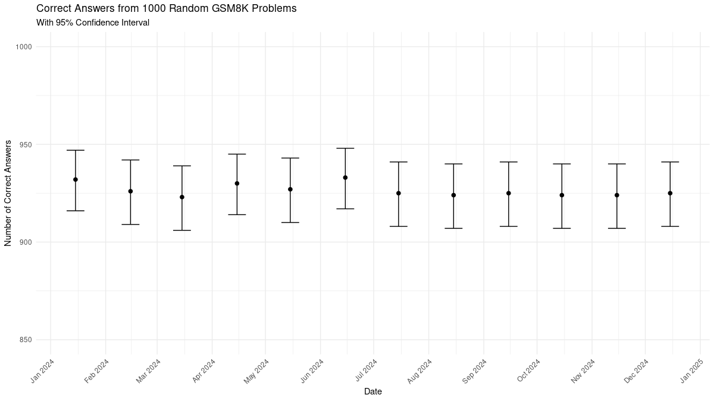

Trying to see if there is anything in [this grand theory](https://x.com/nearcyan/status/1829674215492161569) about claude getting lazy in summer by asking Claude to answer 1000 randomly selected gsm8k math problems.

I found some variability but nothing statistically significant:

If you are trying to reproduce the results, delete all the traces and run in following order:
- evaluate_claude.py (If you are in usage tier 1 may want to slow down and not slam the API)
- prepare_dataset_for_analysis.py (this creates .csv files I use in R for analysis)
- data_analysis.R for creating plots etc
